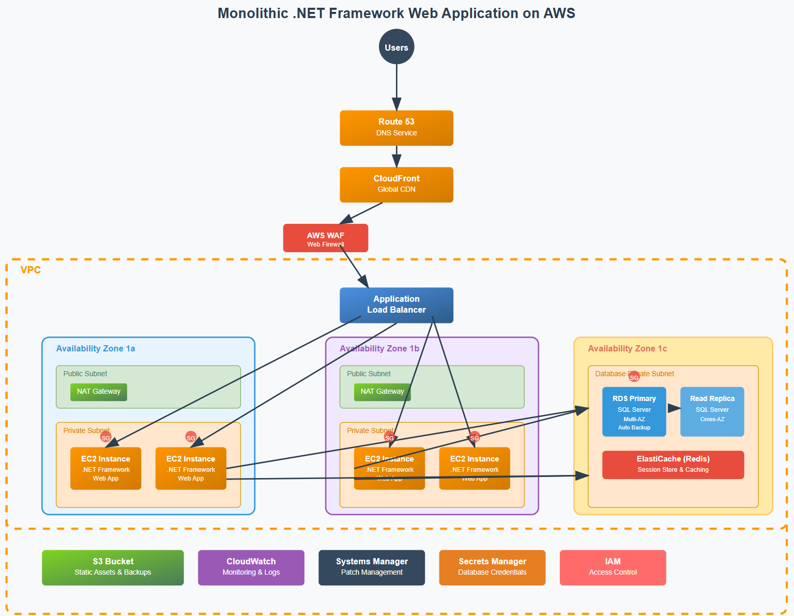

# Monolithic .NET Framework Web Application on AWS - Architecture Documentation

## Architecture Components

### Frontend Layer
- **Route 53**: DNS service for domain resolution
- **CloudFront**: Global CDN for content delivery and DDoS protection
- **AWS WAF**: Web Application Firewall for filtering malicious requests

### Load Balancing
- **Application Load Balancer**: Distributes traffic across multiple EC2 instances

### Compute Layer
- **EC2 Instances**: Windows Server instances running .NET Framework web application
- **Multi-AZ Deployment**: Instances spread across two availability zones for high availability
- **Auto Scaling**: Implied capability for handling traffic fluctuations

### Database Layer
- **RDS SQL Server**: Primary database with Multi-AZ deployment
- **Read Replica**: Cross-AZ read replica for read scalability
- **ElastiCache Redis**: Session storage and application caching

### Supporting Services
- **S3**: Static asset storage and backup repository
- **CloudWatch**: Monitoring, logging, and alerting
- **Systems Manager**: Patch management and configuration
- **Secrets Manager**: Secure credential storage
- **IAM**: Identity and access management

## Security Considerations

### Network Security
- VPC with public/private subnets
- Security Groups (SG) for instance-level firewalls
- NACLs for subnet-level security
- NAT Gateways for secure outbound internet access

### Application Security
- AWS WAF protection against common web exploits
- SSL/TLS encryption via CloudFront and ALB
- Security Groups restricting database access to application tier only

### Data Security
- RDS encryption at rest and in transit
- Secrets Manager for database credentials
- S3 bucket encryption and versioning
- ElastiCache encryption for session data

### Access Control
- IAM roles and policies for EC2 instances
- Least privilege access principles
- MFA for administrative access

### Monitoring & Compliance
- CloudWatch for security monitoring
- VPC Flow Logs for network traffic analysis
- CloudTrail for API call auditing

## Architecture Benefits

### High Availability
- Multi-AZ deployment across two availability zones
- Application Load Balancer with health checks
- RDS Multi-AZ for automatic failover
- Auto Scaling Groups for instance replacement

### Scalability
- Horizontal scaling via Auto Scaling Groups
- Read replicas for database read scalability
- CloudFront for global content distribution
- ElastiCache for improved application performance

### Security
- Defense in depth with multiple security layers
- Network isolation through VPC and subnets
- Encryption at rest and in transit
- Centralized credential management

### Operational Excellence
- Automated patching through Systems Manager
- Comprehensive monitoring with CloudWatch
- Centralized logging and alerting
- Infrastructure as Code capabilities